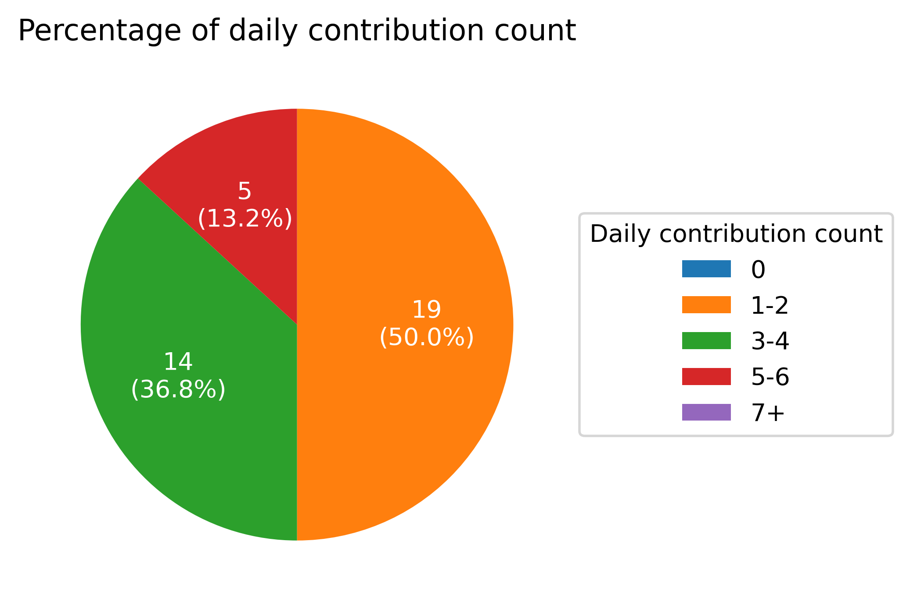

# Welcome to lntuition's Contribution Report
This report is auto generated by [daily-contribution-checker](https://github.com/lntuition/daily-contribution-checker).
If you have any question or problem, please report [here](https://github.com/lntuition/daily-contribution-checker/issues).
I hope this report will be a companion for your contribution trip :airplane:

## Summary
- **2020-08-08** is **39th day** since the start of trip :sweat_smile:
- During the trip, total contribution count is **102** 
and average contribution count is **2.62**
- Daily maximum contribution day is **2020-07-16**, which is **5**.
- Longest continous contribution trip was **39** days 
From **2020-07-01** to **2020-08-08** :walking:
- Current continous contribution trip is **39** days 
From **2020-07-01** :running:
- There was **2** new contribution at **2020-08-08**.
Good job :+1:

## Graph

## Contribution table
|      DATE       | MON | TUE | WED | THU | FRI | SAT | SUN |
|:---------------:|:---:|:---:|:---:|:---:|:---:|:---:|:---:|
| Week 27 of 2020 |     |     |  2  |  1  |  1  |  1  |  4  |
| Week 28 of 2020 |  3  |  2  |  1  |  1  |  1  |  1  |  1  |
| Week 29 of 2020 |  3  |  3  |  2  |  5  |  3  |  1  |  2  |
| Week 30 of 2020 |  4  |  5  |  3  |  4  |  3  |  2  |  1  |
| Week 31 of 2020 |  5  |  5  |  4  |  3  |  4  |  1  |  3  |
| Week 32 of 2020 |  2  |  2  |  2  |  5  |  4  |  2  |     |

        