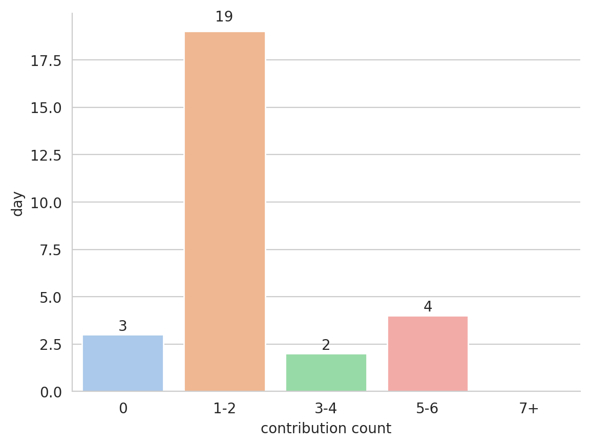
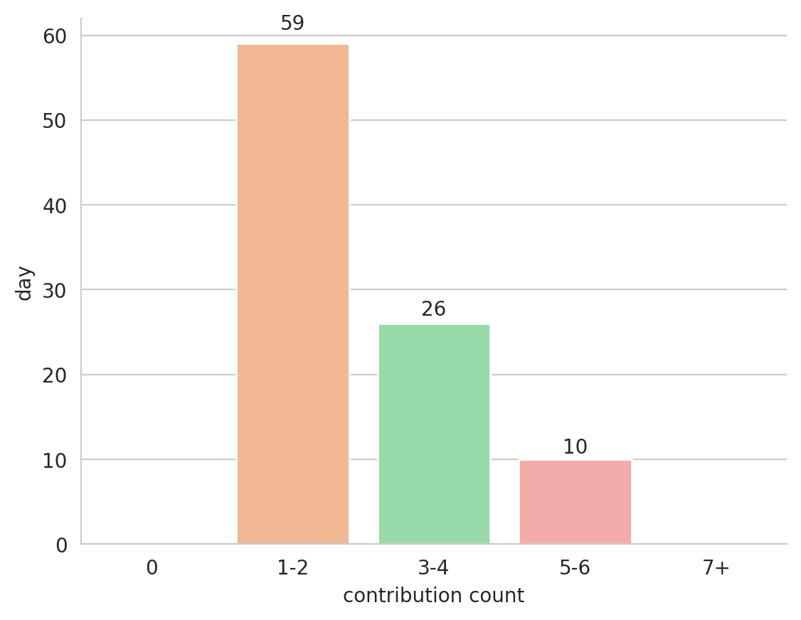
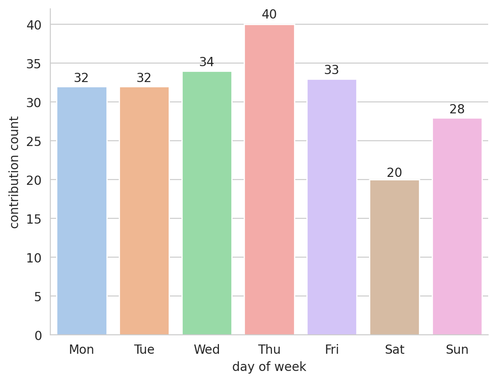
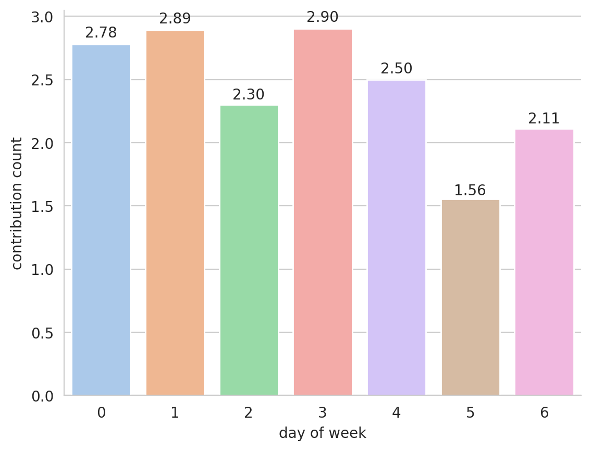
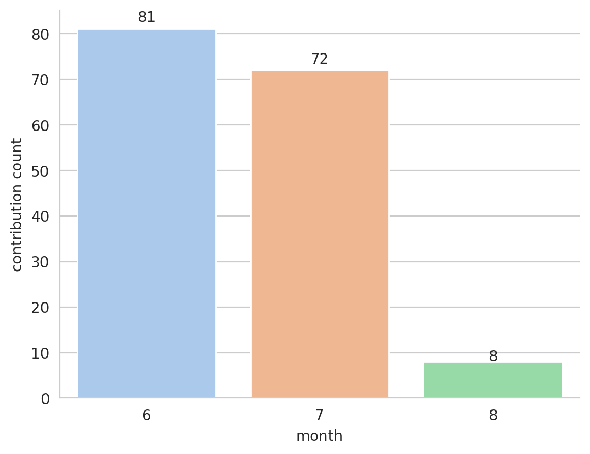
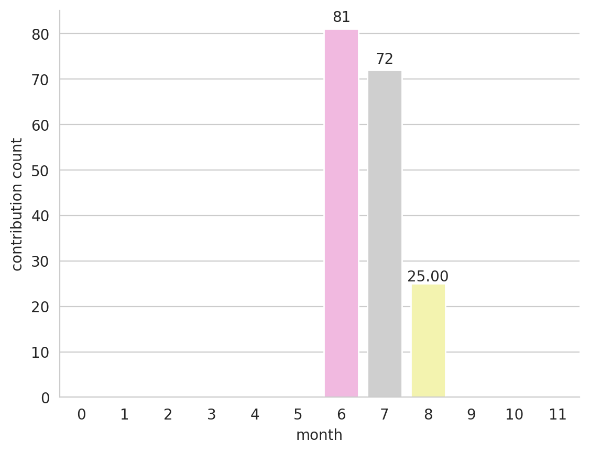

# Welcome to lntuition's contribution report

This report is generated by [contribution-markdown-report](https://github.com/lntuition/contribution-markdown-report).
If you have any question or problem, please report [here](https://github.com/lntuition/contribution-markdown-report/issues).
I hope this report will be a companion for your contribution trip. :airplane:

## Summary
- **2020-10-01** was **93**th day since the start of trip, and there was **2** new contribution. :+1:
- Daily maximum contribution day is **2020-09-24**, which is **6**. :muscle:
- During the trip, total contribuition count is **221** and average contribution count is **2.38**. :clap:
- Longest continuous contribution trip was **93** days from **2020-07-01** to **2020-10-01**. :walking:
- Current continuous contribution trip is **93** days from **2020-07-01**. :running:
## Graph
| **Number of days per contribution up to the last 4 weeks** | **Number of days per contribution** |
|:--:|:--:|
|  |  |
| **Number of contribution per day of week up to the last 12 weeks** | **Average of contribution per day of week** |
|  |  |
| **Number of contribution per month up to the last year** | **Average of contribution per month** |
|  |  |