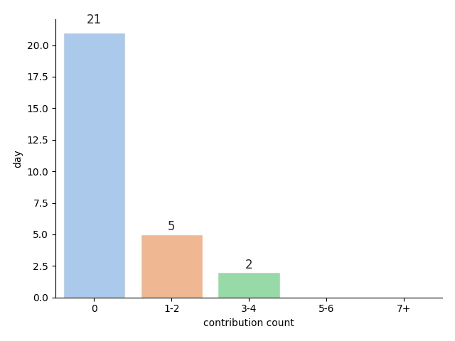
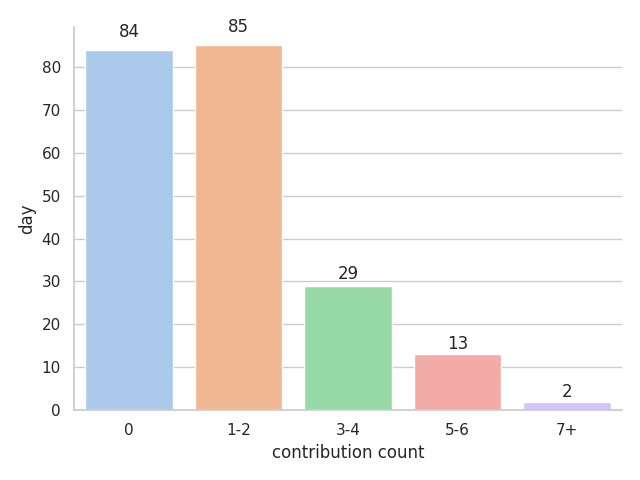
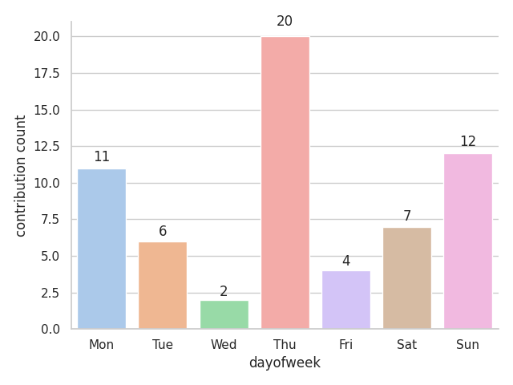

# Welcome to lntuition's contribution report
This report is generated by [contribuition-markdown-report](https://github.com/lntuition/contribution-markdown-report).
If you have any question or problem, please report [issue](https://github.com/lntuition/contribution-markdown-report/issues).
## Summary
- **2021-01-15** was **199**th day since the start of trip, and there was **0** new contribution. :+1:
- Maximum contribution day is **2020-12-27**, which is **8**. :muscle:
- During the trip, total contribuition count is **295** and average contribution count is **1.48**. :clap:
- Current continuous contribution trip is **0** days from **2021-01-15**. :walking:
- Longest continuous contribution trip was **99** days from **2020-07-01** to **2020-10-07**. :running:
## Graph
|     **Number of days per contribution up to the last 4 weeks**     |     **Number of days per contribution**     |
|:------------------------------------------------------------------:|:-------------------------------------------:|
|                                     |                |
| **Number of contribution per day of week up to the last 12 weeks** | **Average of contribution per day of week** |
|                                 |           |
|      **Number of contribution per month up to the last year**      |     **Number of contribution per year**     |
|                                     |                 |